# 二重积分

> 来源：大观《二重积分题库答案.pdf》PDF 目录 · 完整目录结构
> 澄潇宇、一只羊 & 南门朔

---

## tips

要写清楚带入的数值是x还是y，y=1y=x

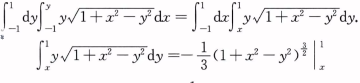

## 先后

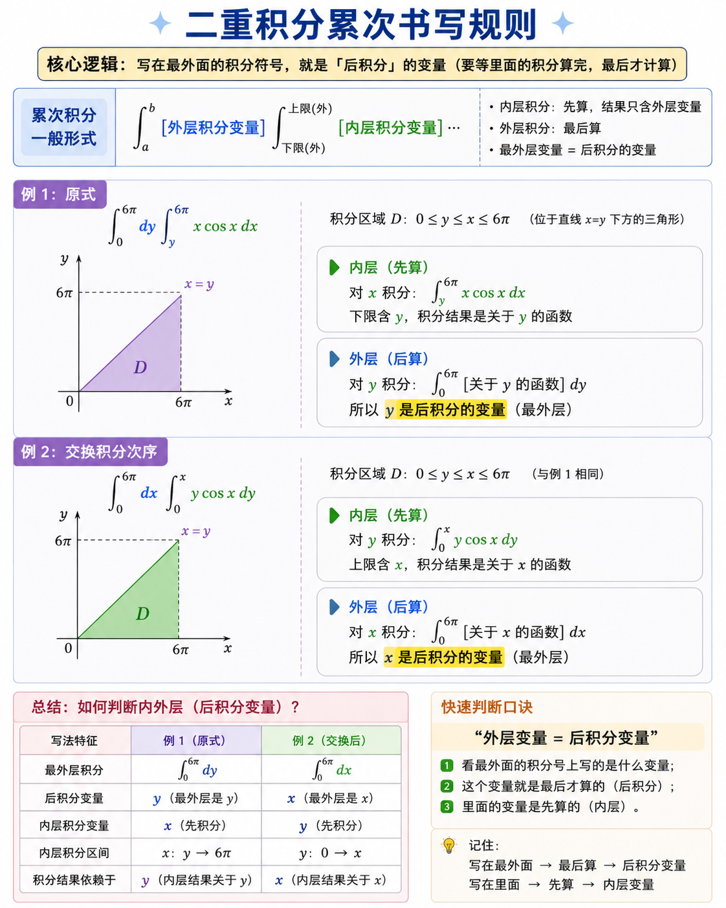

## 对称性

### 有对称性

#### 关于原点或者xy轴对称

一个定死了看另一个

关于x对称就看y

#### 关于y=x对称

可以通过观察发现交换（**这里一定一定一定要注意，是积分区域x和y可以交换**）xy式子不变，关于y=x对称的

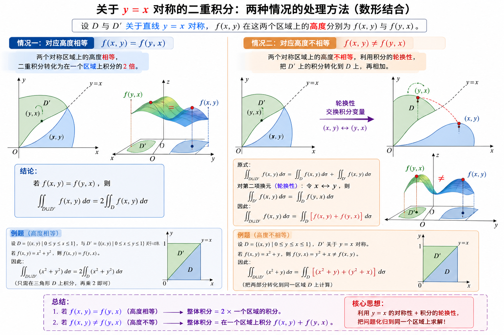

1.f(x,y)等于f(x,y)

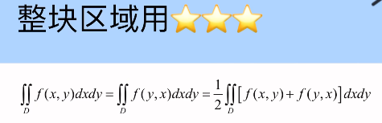

人为交换xy可以构造出关于x和y对称的图像

可以变成在一半区域上面积分，拆分成d1和d2，把d2区域变成d1

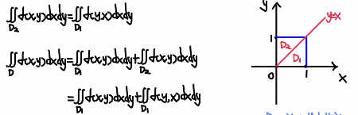

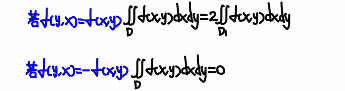

可以拆成两部分只在一部分用这个对换

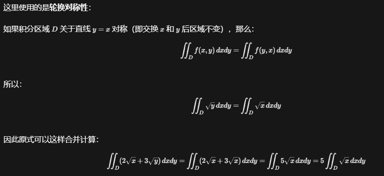

#### 四等分形

积分区间，包含绝对值或者平方，任何x和y的符号都让数值不变

对于函数，可以消去或者乘倍数

x，y，xy分别都能消掉，在四个区间内两正两负，没了

> ✅ **前提是：积分区间/区域关于该变量“中心对称”（比如 [−a,a]、圆盘、球体等）**

在这个前提下——**奇函数幂次的项，积分结果直接为 0，相当于“直接抹掉”**。

#### 合并或者分裂

方形变两个三角形，三角形变一半正方形

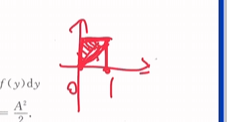

## 积分方式

### 关于xy分次

### 关于极坐标

- 普通极坐标

观察到有**x和y的平方（或者同次构造y/x）**，或者积分区域就是极坐标形式

积分上限直接根据x和y的表达式带进去求解出r

- 广义极坐标

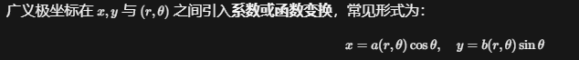

## 积分次序（积不出来，可以相消或者轮换）

### xy换序

发现不能积分的额必须交换，比如ex/x   sin/x呢多的，

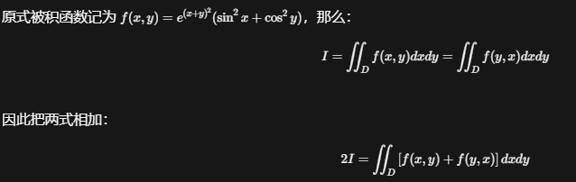

### 极坐标换序

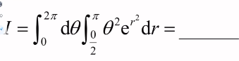

1.换序

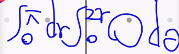

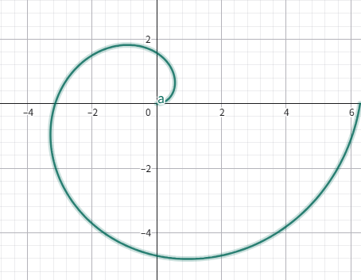

2.直接当成xy

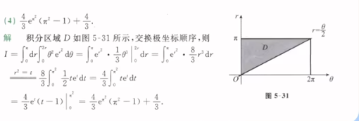

### 没次序，利用面积

几何思路：被积函数 $\sqrt{ a^2−y^2}$ 就是「四分之一圆的面积」

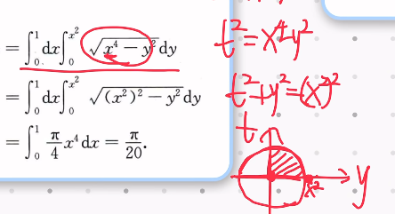

## 雅可比行列式

### 使用

**一定要注意这里有绝对值**

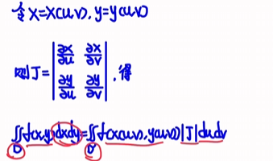

如果u和v分别等于x和y的函数，直接微分就可以

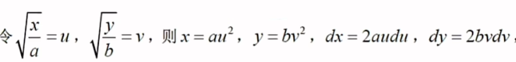

### 倒数关系

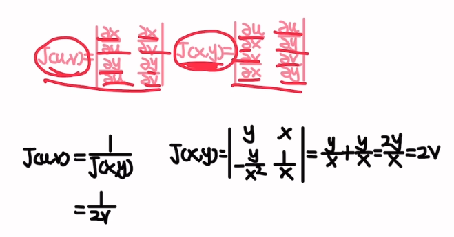

例题1

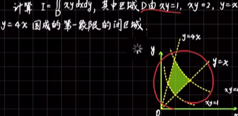

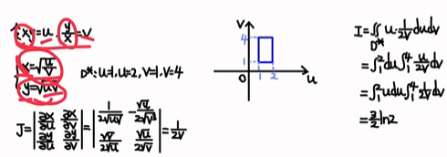

### 平移变换

## 补充

### 偏心园

正半轴就是正，x周就是cos

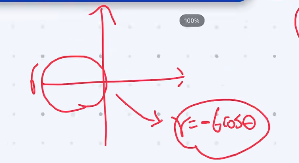

### 二重积分积分是面积

### 针对反三角函数

看在不在住址区间不在主旨区间于在主旨区间的关于x=pi/2对称

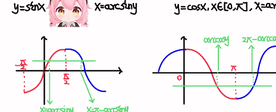

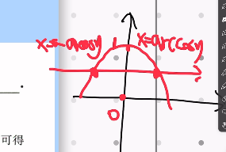

## A.计算

分割

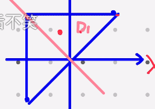

填补

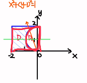

### 1.直接给出累次积分

### 2.直角坐标

#### a)常规题

#### b)二重积分与多元微分结合（罕见）

凑两次微分

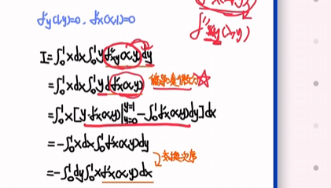

#### c)积分区域D由参数方程给出（摆线）

积分区域直接写成y(x)后面积分的时候，零x等于t的函数，此时y自动变成了t的函数，直接带入参数方程

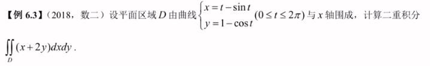

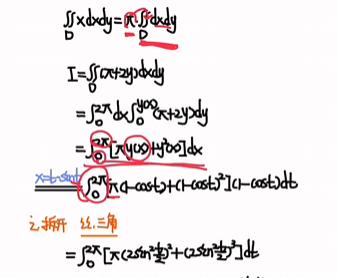

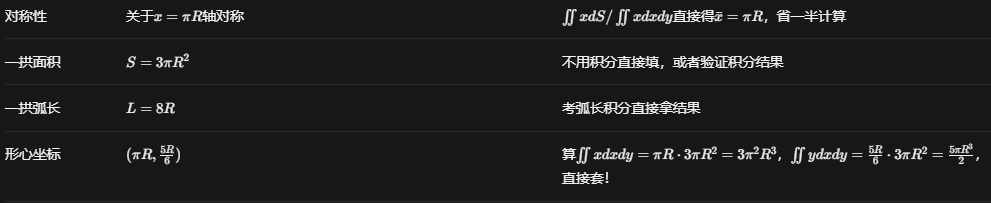

#### d)极坐标逆问题（极坐标转回直角）

看到了rcosseta和rsinseta转化成x和y

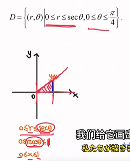

三个都有了，x和y和dxdy

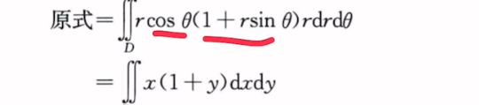

#### e)极坐标逆问题2

不看成极坐标就直接当作x和y换序直接换

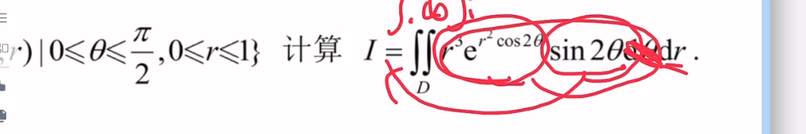

#### f)积分等式、

两边同时在区域内积分看成一个，二重积分里面的二重积分计算结果看成一个数，||f(x，y)等于A

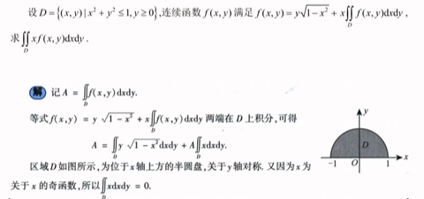

### 3.极坐标

#### a)圆域相关

#### b)椭圆域

用雅可比转换成在圆上积分

#### c)偏心圆域相关

用雅可比

#### d)arc区间问题

计算的时候要放到区间内部，也就是上下限pi和3/4pi出来不会等于setae的要变换到-pi/2到pi/2区间上

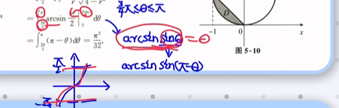

比如这里下限对应的当y等于0时候arcsiny等于0显然不是这个积分区域的下限在x周上的落点而是pi所以使用pi-arcsiny

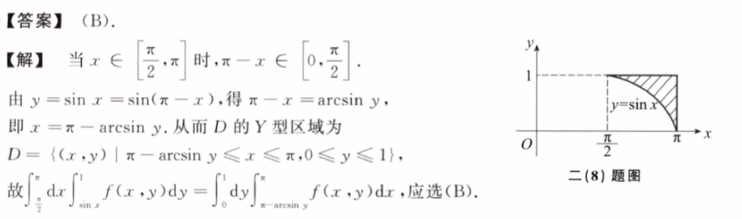

#### e)积分区域以极坐标方程给出

#### f)积分区域难画

转极坐标或者描点

这儿可以对第一个区域求导，看他的凹凸性，可以大概知道图长啥样（不过感觉没啥用啊）

也可以就不画图了，两个曲线大致夹住目标

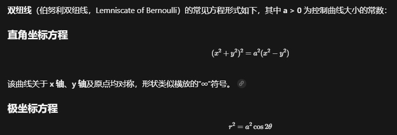

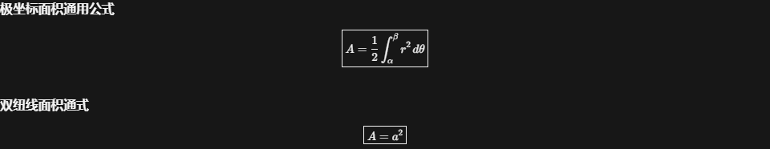

#### g)被积函数为若干项相加

#### h)被积函数分子是分母其中一项

### 4.被积函数为分段函数

#### a)显式分段

剩下的都是0

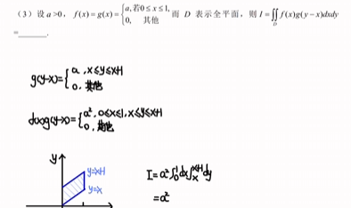

#### b)隐式分段

##### (1)绝对值

$\int_{0}^{\pi} \bigl|\sin(x+a)\bigr|\,dx= \int_{0}^{\pi} \sin x\,dx\ = 2$

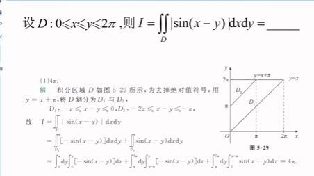

##### (2)最大值最小值

##### (3)取整

## B.其他

### 1.交换积分次序

#### a)直角坐标交换

#### b)极坐标交换（不算太懂）

这里不是根据角度来划分了，按照r对应的θ的不同把区域分成两部分

核心就是：固定r时，θ的下限是谁，会随着r变大发生切换

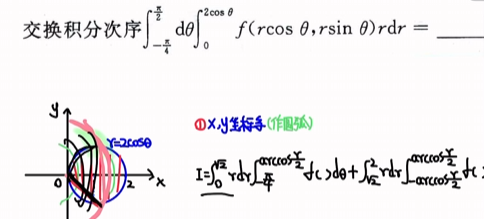

也可以变成，他们独特的坐标系

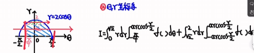

#### c)极直互换

#### d)写极坐标

### 2.二重积分比大小以及定正负

### 3.以二重积分形式给出的函数

### 4.利用含二重积分等式求函数表达式

### 5.抽象函数二重积分

### 6.二重积分定义

### 7.二重变限积分求极限

### 8.二重积分应用

#### a)面积

#### b)体积

#### c)形心

#### d)质心
