# 多元微分

> 来源：大观《【紧凑】多元微分.pdf》PDF 目录 · 完整目录结构
> 澄潇宇、一只羊 & 南门朔

---

## 注意

这里是先对x再对y求

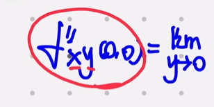

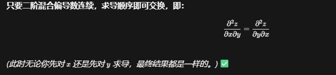

## 复合函数偏导

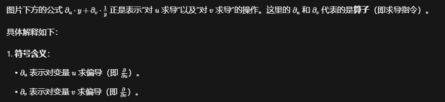

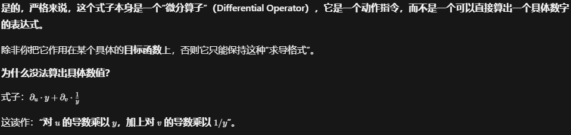

最重要吧第一个位置的导数写成1，第二个位置的导数写成2没有的不写

## 轮换对称性

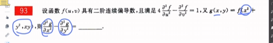

轮换的导数格式一样

## 隐函数求导法则（一阶用，最简单）

这里把别的看作**常数**，即使z=f（x，y）

这里条件偏导不等于0就可以写成z(x,y)

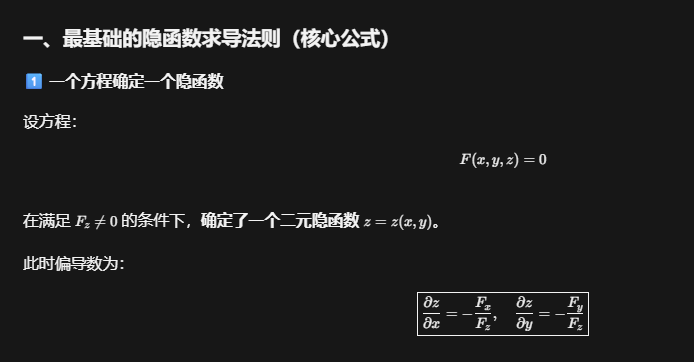

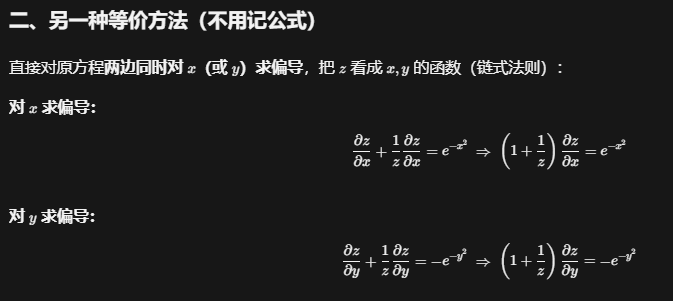

## 全微分形式不变性

这里z必须看作函数

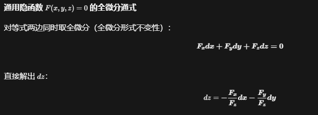

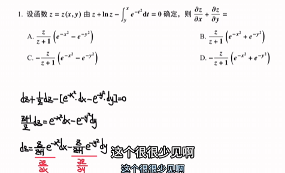

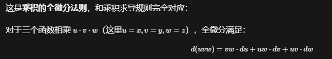

## A.概念题

### 1.基本概念题

#### 可微

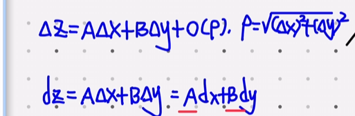

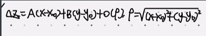

##### 0,0可微

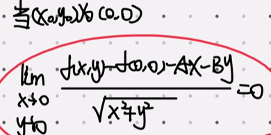

##### 可微的极限形式

「只要找到一组A,B满足定义，函数就可微；且这组A,B一定唯一，不可能有第二组」

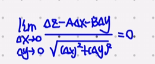

或者用脱帽法严格证明

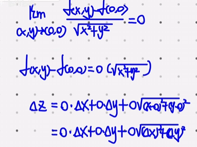

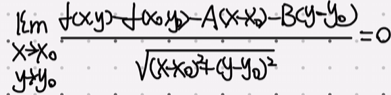

#### 推论

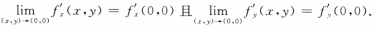

​                                                                                           ↓就是（对x和y的偏导数在四面八方连续）

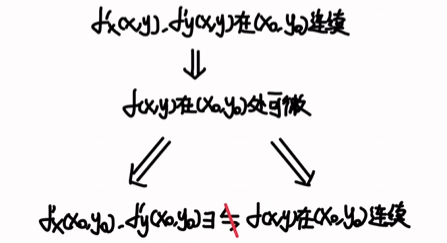

偏导数**连续**最顶级，，，，，，如果 fx,fy **连续**，说明在 (x0,y0) 附近，变化率本身是“平稳”的，于是我们可以放心地用**两个方向的变化拼出一个切平面**。

连续不一定可导，经典

类比一元函数，固定x或者y的时候才可以用一元函数的结论，或者同时逼近0点才有很强的信服力

#### 偏导定义

y不动逼近x，x不动逼近y

#### 反例

### 2.已知具体多元函数判断其他

#### 用定义式判断极限是否存在

带入计算极限，趋近就不等于，趋近（0，0）点就不等于（0，0）可以（1，0），x单独趋近于0就不能等于0，y单独同理（重极限等于函数值）

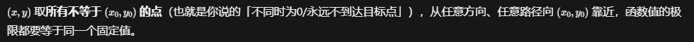

算二阶导的一阶导比如y趋近于0，带进去算极限的时候，y不能取到0

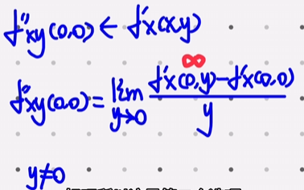

[精彩例题一个](https://www.bilibili.com/video/BV1FShNzVErn/?share_source=copy_web&vd_source=33e22adc6cbaa752e39b227cebb4a53a&t=1851)

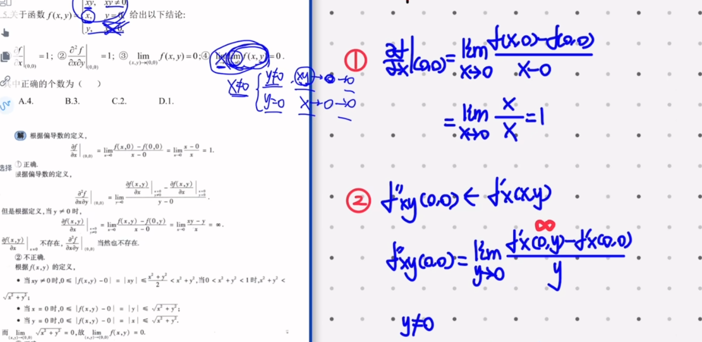

例题2【CXY-007素人教師の多元微分大观（中国語字幕)】 【精准空降到 40:24】 https://www.bilibili.com/video/BV1FShNzVErn/?share_source=copy_web&vd_source=33e22adc6cbaa752e39b227cebb4a53a&t=2424

b选项“偏导函数在某条直线上（y=0）的极限 和 一点处（0，0）的偏导数

分别用导数的定义（直接函数对x求导d/dx）和偏导数的定义（在y=0时候的偏导数）

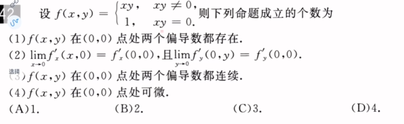

例题3【CXY-007素人教師の多元微分大观（中国語字幕)】 【精准空降到 56:46】 https://www.bilibili.com/video/BV1FShNzVErn/?share_source=copy_web&vd_source=33e22adc6cbaa752e39b227cebb4a53a&t=3406

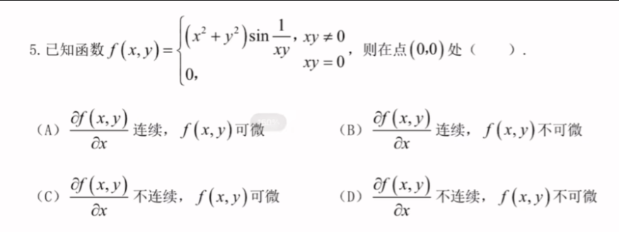

例题3【CXY-007素人教師の多元微分大观（中国語字幕)】 【精准空降到 1:01:47】 https://www.bilibili.com/video/BV1FShNzVErn/?share_source=copy_web&vd_source=33e22adc6cbaa752e39b227cebb4a53a&t=3707

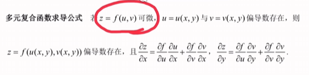

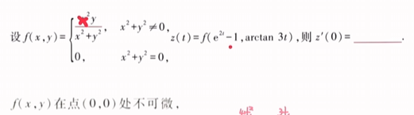

# 这里没听（1：25到2：25）

#### 用放缩所严格证明

判断极限是否存在，即|f(x,y)-A|的极限是否等于0，此时被压死在A

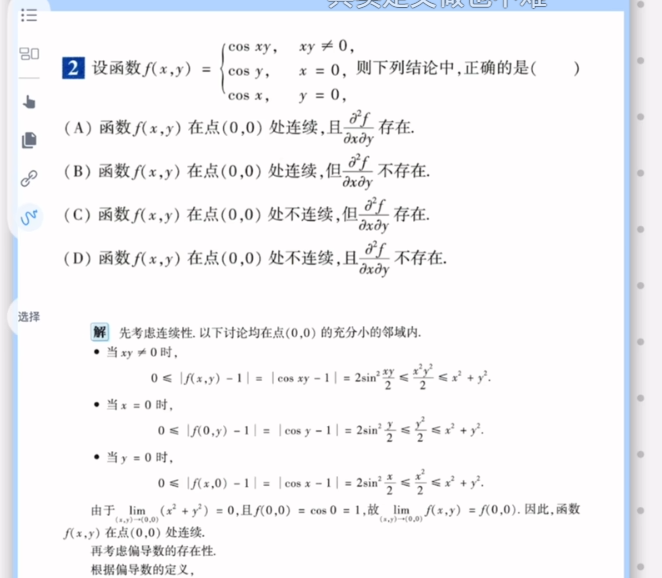

## B.重极限

### 1.求重极限

##### 计算方法

若果用正常的方法就是泰勒放缩然后夹逼

##### 取特殊路径

###### 证明存在

###### 证明不存在（极限不唯一）

用y=kx做，k可变

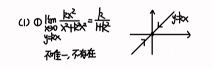

##### 模型

这里分子是相乘

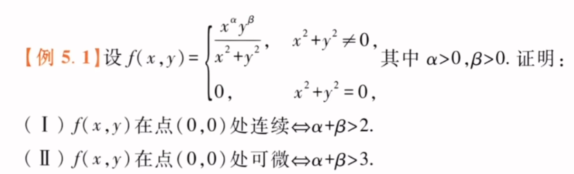

对于一个二元函数极限要在某一点存在，该函数必须在该点的一个去心邻域内处处有定义（对于分母是奇数次方，令y=-x）此时无意义，所以不存在

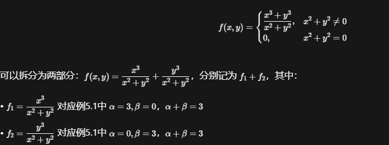

##### 变成模型

把y的四次方变成u的平方

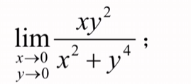

### 2.已知重极限推导其他

#### a)已知重极限求偏导/判断可微/求全微分

#### b)已知重极限求多元复合函数极值

## C.偏导数

### 1.多元函数求偏导

定点先代后求，或者用定义求

这一类就是对函数的偏导数的可能取值进行分类，也就是对不同的xy进行分类，能带入的就带入，不能代入得只能用定义

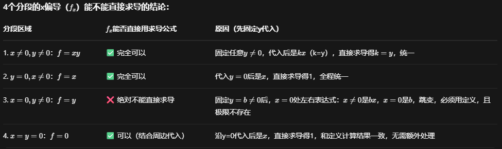

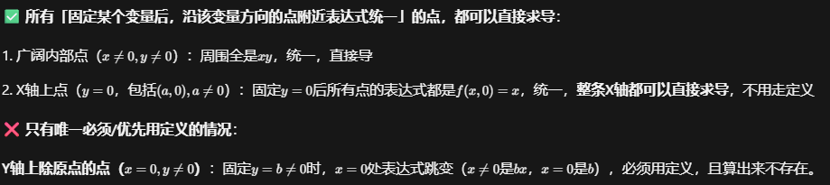

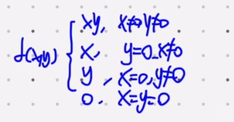

有绝对值先分段，发现相等于0的时候求导x到分母了，所以此时导数不存在，我们改用定义从y不同方向逼近

看看能不能找到使得函数导数存在的情况

【CXY-007素人教師の多元微分大观（中国語字幕)】 【精准空降到 2:30:33】 https://www.bilibili.com/video/BV1FShNzVErn/?share_source=copy_web&vd_source=33e22adc6cbaa752e39b227cebb4a53a&t=9033

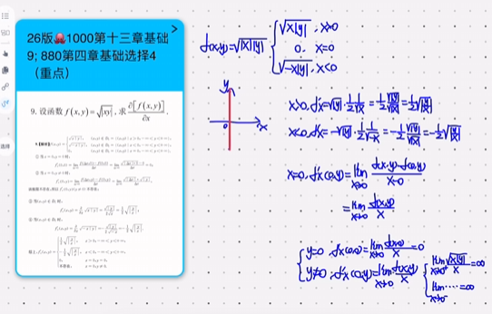

#### a)一阶偏导

##### (1)判断偏导存在

##### (2)常规

##### (3)考察换元思想

这道题可以换元或者直接两边求偏导

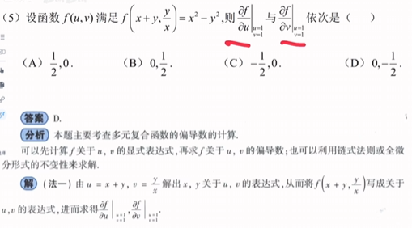

#### b) 二阶偏导

如果对y或者对x两次求导那么此时就不能直接代数值，只有当只操作x的时候才能直接带入y

##### (1)分段函数

##### (2)常规

##### (3)含变限积分

常用凑微分或者换元

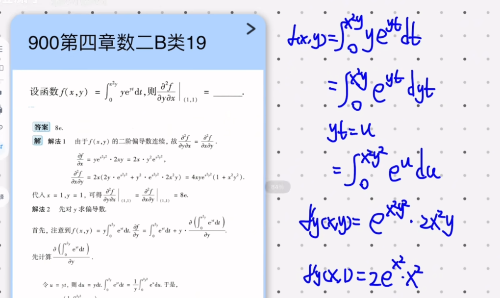

#### 注意，一元函数和多元函数

这里函数是一元函数

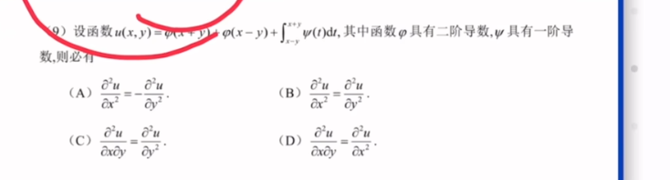

#### c) n阶偏导

### 2.多元复合函数求偏导

#### a)f(u)

##### (1)常规一阶

##### (2)常规二阶

#### b)f(u,v)

##### (1)常规一阶

偏微分

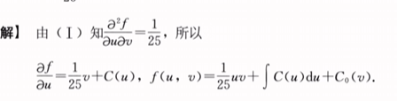

两端求偏导

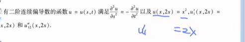

#### (2)常规二阶

##### (3)f套f

套娃

##### (4)极坐标

### 3.利用变量代换化简偏微分方程

#### a)线性变换

### 4.多元隐函数求偏导

求导代换消去

#### a)一个方程三个未知数(常规)

##### (1)一阶

##### (2)二阶

#### b)一个方程两个未知数

#### c)两个方程三个未知数

#### d)两个方程四个未知数

#### e)两个方程五个未知数

#### f)三个方程四个未知数

#### g)三个方程五个未知数

### 5.求全微分

#### a)具体

##### (1)普通函数

##### (2)隐函数

隐函数最好用

两端求偏导

#### b)抽象函数

### 6.已知偏导数相关求多元函数(偏积分)

#### a)已知偏导数

#### b)已知全微分

#### c)已知关系式

## D.多元微分应用

### 1.单调性

### 2.无条件极值

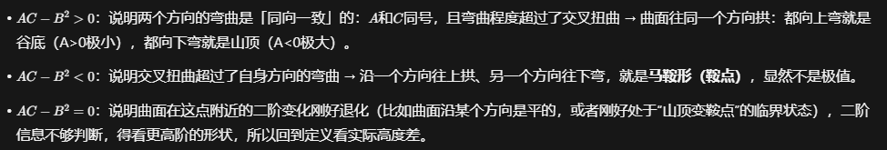

等于0取反例，两个限趋近不一样y=0或者y=-x

这里绝大数情况下两边求导方便

要是用公式的话要算出一阶在对一阶求导得到二阶再带入

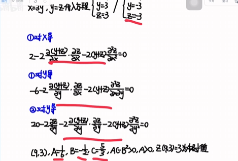

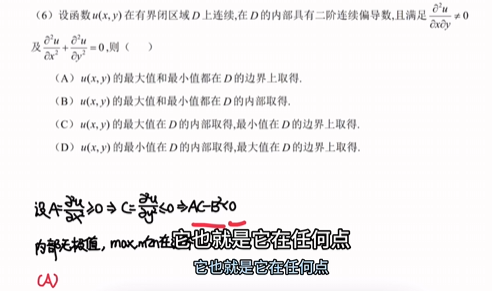

#### a)概念题

#### b)直接给出函数

#### c)先求函数再求极值

##### (1)已知偏导数

##### (2)已知全微分

##### (3)已知关系式

#### d)多元隐函数极值

#### e)已知极值反求参数

### 3.条件极值

#### a)直接给出

##### (1)单约束

##### (2)双约束

#### b)需要处理条件

##### (1)距离

##### (2)面积

#### c)数一专项

具体知识点拆解如下：

1. **目标函数等价转化**：“根号下u等价于u”、“e的u次方等价于u”、“lnu等价于u”、“u的绝对值等价于u方”。**
2. **乘非0因子消a，讨论因子是否为0**：在方程化简或求解过程中，如果方程两边有公因式，直接约去（即乘非0因子消元）时，必须注意这个因子可能为0的情况。如果约去了可能为0的因子，就会导致漏解，因此需要单独讨论该因子为0时的情况。
3. **边界曲线不封闭讨论端点**：在求闭区域上的连续函数最值时，如果区域的边界曲线是不封闭的（即不是完整的闭环），除了求内部的驻点外，还必须专门讨论边界曲线的端点（起点和终点）处的函数值，以防最值出现在这些端点上。

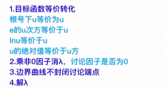

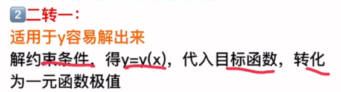

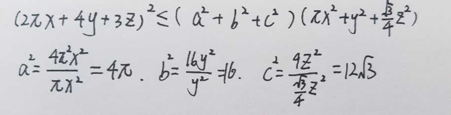

### 4.闭区域最值

#### a)判断最值点位置

#### b)闭区域

#### c)确定多元函数不等式参数取值范围

#### d)数一专项
