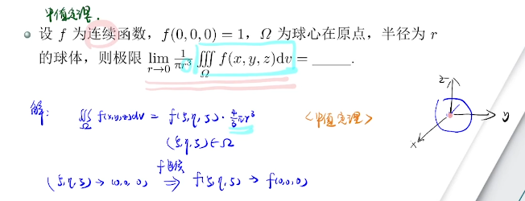
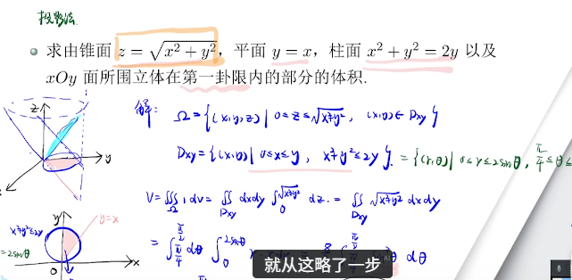
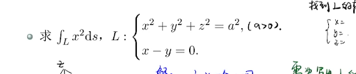

# 曲线曲面积分

## 开头：三重积分怎么算

- 不换元
- 投影法
- 截面法

---

### 换元 · 球面坐标

球心在原点、半径相关的区域，常用球面坐标：

$$
\begin{cases}
x=r\sin\varphi\cos\theta \\
y=r\sin\varphi\sin\theta \\
z=r\cos\varphi
\end{cases}
$$

| 变量 | 含义 | 常见范围 |
|------|------|----------|
| $$r$$ | 到原点距离 | $$r\ge 0$$（球内：$$0\le r\le R$$） |
| $$\varphi$$ | 与正 $$z$$ 轴夹角 | $$0\le\varphi\le\pi$$ |
| $$\theta$$ | 在 $$xOy$$ 上的极角 | $$0\le\theta\le 2\pi$$ |

**体积微元（注明 $$\mathrm{d}V$$）：**

$$
\mathrm{d}V=\mathrm{d}x\,\mathrm{d}y\,\mathrm{d}z
=\boldsymbol{r^{2}\sin\varphi}\,\mathrm{d}r\,\mathrm{d}\varphi\,\mathrm{d}\theta
$$

即雅可比 $$J=\boldsymbol{r^{2}\sin\varphi}$$，换元后：

$$
\iiint_{\Omega} f(x,y,z)\,\mathrm{d}V
=\iiint f(r\sin\varphi\cos\theta,\,r\sin\varphi\sin\theta,\,r\cos\varphi)\,
\boldsymbol{r^{2}\sin\varphi}\,\mathrm{d}r\,\mathrm{d}\varphi\,\mathrm{d}\theta
$$

> 别漏 **$$\boldsymbol{r^{2}\sin\varphi}$$**。

---

### 换元 · 只换 $x,y$（柱坐标 / 极坐标）

$$z$$ 不动，只在 $$xOy$$ 上换极坐标：

$$
\begin{cases}
x=r\cos\theta \\
y=r\sin\theta \\
z=z
\end{cases}
$$

| 变量 | 含义 | 常见范围 |
|------|------|----------|
| $$r$$ | 到 $$z$$ 轴距离 | $$r\ge 0$$ |
| $$\theta$$ | 极角 | $$0\le\theta\le 2\pi$$ |
| $$z$$ | 不变 | 按区域定 |

**体积微元：**

$$
\mathrm{d}V=\mathrm{d}x\,\mathrm{d}y\,\mathrm{d}z
=\boldsymbol{r}\,\mathrm{d}r\,\mathrm{d}\theta\,\mathrm{d}z
$$

（平面上 $$\mathrm{d}x\mathrm{d}y=\boldsymbol{r}\,\mathrm{d}r\mathrm{d}\theta$$，再乘 $$\mathrm{d}z$$。）

> 球坐标里的 $$r$$ = 到**原点**距离；柱坐标里的 $$r$$ = 到**$$z$$ 轴**距离。别混。

---

### 规范图形直接算

区域是球、柱、锥等标准形体时，也可直接用体积 / 面积公式，不必换元硬算。

---

## 曲线积分

### 一形（对弧长）

- 闭曲线：$$\oint$$
- 几何：沿曲线「高低不一的篱笆」的侧面积；$$\int_L 1\,ds=$$ **弧长**

---

#### 性质

| 性质 | 含义 |
|------|------|
| 线性性 | $$\int_L(\alpha f+\beta g)\,ds=\alpha\int_L f\,ds+\beta\int_L g\,ds$$ |
| 弧段可加性 | $$L=L_1\cup L_2$$ 时可拆 |
|  |  |
| 比较 / 绝对值 | $$f\le g\Rightarrow\int f\le\int g$$ 等 |

---

#### 计算：参数化 → 定积分

就是把换元的东西的平方写进去

| 情形 | 曲线形式 | 弧长元素 / 公式 |
|------|----------|-----------------|
| ① 参数方程 | $$x=\varphi(t),\; y=\psi(t),\; t\in[\alpha,\beta]$$ | $$\displaystyle\int_L f\,ds=\int_{\alpha}^{\beta}f(\varphi,\psi)\sqrt{\varphi'^2+\psi'^2}\,dt$$ |
| ② 显式 | $$y=y(x)$$ | $$ds=\sqrt{1+[y'(x)]^2}\,dx$$ |
| ③ 显式 | $$x=x(y)$$ | $$ds=\sqrt{1+[x'(y)]^2}\,dy$$ |
| ④ 极坐标 | $$r=r(\theta)$$ | $$ds=\sqrt{r^2+(r')^2}\,d\theta$$ |
| ⑤ 空间曲线 | $$x(t),y(t),z(t)$$ | $$ds=\sqrt{x'^2+y'^2+z'^2}\,dt$$ |

2. **可代入曲线方程**到被积函数；二重/三重不能把边界方程代入区域内部（因为是对面内部的所有点而不是边上的）
3. **参数选取**影响难度（如 $$y^2=x$$ 用 $$y$$ 作参更干净）

---

#### 对称性

- **关于 x 轴对称” ⇔ 固定 x，看 y → −y 时被积函数怎么变。**变号就为0
- **轮换对称**：曲线方程对 $$x,y,z$$ 轮换不变时

$$
\int_L f(x,y,z)\,ds
=\int_L f(y,z,x)\,ds
=\int_L f(z,x,y)\,ds
$$

---

### 二形（对坐标）

- 有方向：下限对起点、上限对终点，$$\alpha$$ 不必小于 $$\beta$$

---

#### 三种写法

- 分开写：$$\int_L P\,\mathrm{d}x$$，$$\int_L Q\,\mathrm{d}y$$
- 合并（最常见）：$$\int_L P\,\mathrm{d}x+Q\,\mathrm{d}y$$；闭路用 $$\oint$$
- 向量形式：$$\int_L\vec{F}\cdot\mathrm{d}\vec{r}$$，其中 $$\vec{F}=P\mathbf{i}+Q\mathbf{j}$$，$$\mathrm{d}\vec{r}=\mathrm{d}x\,\mathbf{i}+\mathrm{d}y\,\mathbf{j}$$

---

#### 与一型的联系（二形 → 一形）

- 平面：$$\mathrm{d}x=\mathrm{d}s\cos\alpha$$，$$\mathrm{d}y=\mathrm{d}s\cos\beta$$
- 空间：$$\mathrm{d}x=\mathrm{d}s\cos\alpha$$，$$\mathrm{d}y=\mathrm{d}s\cos\beta$$，$$\mathrm{d}z=\mathrm{d}s\cos\gamma$$  
  （$$\alpha,\beta,\gamma$$ 为切向与 $$x,y,z$$ 轴正向夹角）

$$
\int_L P\,\mathrm{d}x+Q\,\mathrm{d}y+R\,\mathrm{d}z
=\int_L\bigl(P\cos\alpha+Q\cos\beta+R\cos\gamma\bigr)\,\mathrm{d}s
$$

**对 $$L$$ 上任意动点 $$(x,y)$$，写出当前取向下的 $$(\cos\alpha,\cos\beta)$$：**

- **参数曲线** $$x=x(t),\;y=y(t)$$（$$t$$ 增加的方向为 $$L$$ 方向）——通用万能写法：

$$
\cos\alpha=\frac{x'(t)}{\sqrt{x'^2+y'^2}},\qquad
\cos\beta=\frac{y'(t)}{\sqrt{x'^2+y'^2}}
$$

- **显式曲线** $$y=y(x)$$：

$$
\cos\alpha=\frac{1}{\sqrt{1+y'^2}},\qquad
\cos\beta=\frac{y'(x)}{\sqrt{1+y'^2}}
$$

- 空间参数 $$x(t),y(t),z(t)$$：

$$
\cos\alpha=\frac{x'}{\sqrt{x'^2+y'^2+z'^2}},\quad
\cos\beta=\frac{y'}{\sqrt{x'^2+y'^2+z'^2}},\quad
\cos\gamma=\frac{z'}{\sqrt{x'^2+y'^2+z'^2}}
$$

**注意：**

- 有显式 $$y=y(x)$$ 就直接对显式求导，别绕隐函数
- 端点处 $$F_y=0$$（竖切线）→ 隐函数定理失效，不能两边对 $$x$$ 硬求导

---

#### 格林公式

$$
\oint_L P\,\mathrm{d}x+Q\,\mathrm{d}y
=\iint_D\Bigl(\frac{\partial Q}{\partial x}-\frac{\partial P}{\partial y}\Bigr)\,\mathrm{d}x\mathrm{d}y
$$

- 条件：$$P,Q$$ 在 $$D$$ 上有一阶连续偏导；$$L$$ 为 $$D$$ 的**正向边界**
- 正向：沿边界走，区域在**左手边**（通常逆时针）；负向则前面加负号
- 考研常用方向：曲线积分 → 二重（反过来基本不用）

**使用前必查：** 整个 $$D$$ 上偏导是否连续。  
看起来 $$Q_x=P_y$$，但原点等奇点不满足 → 直接套可能算出 $$0$$，其实错。

| 情形 | 办法 |
|------|------|
| 曲线不封闭 | **补线**，围成闭区域再用格林 |
| 区域内有奇点 | **挖洞**，去掉奇点后再用格林 |
| 可代入曲线方程后无奇点 | 先代方程再格林（更简单） |

**补线：** 补易算的线（常平行坐标轴）→ 闭路格林 → 减去补线；注意整体正/负向。

**挖洞：** 区域内有奇点（常在原点）→ 挖掉一个**足够小**的洞 $$L_1$$（写 $$\varepsilon$$ 足够小，保证 $$L_1$$ 在 $$L$$ 里面）→ 环形域上格林（常因 $$Q_x=P_y$$ 得 $$0$$）→

$$
\oint_L=\oint_{L_1^{-}}\quad\text{（或}\;\oint_L=-\oint_{L_1^{+}}\text{）}
$$

再在 $$L_1$$ 上**代入**方程化简后算（或再格林）。

**例：** 分母 $$4x^2+y^2$$，奇点 $$(0,0)$$。取小椭圆

$$
L_1:\quad 4x^2+y^2=\varepsilon^2\quad(\varepsilon>0\text{ 足够小})
$$

方向与外圈成正向环域（内圈常取顺时针）。环形域上 $$Q_x-P_y=0$$ ⇒ $$\oint_L=-\oint_{L_1^{+}}=\oint_{L_1^{-}}$$。  
在 $$L_1$$ 上代入 $$4x^2+y^2=\varepsilon^2$$，被积函数化简成 $$x\,\mathrm{d}y-y\,\mathrm{d}x$$ 一类，再对小椭圆格林（面积 $$\pi\cdot\frac{\varepsilon}{2}\cdot\varepsilon=\dfrac{\pi\varepsilon^2}{2}$$ 等）→ $$\varepsilon$$ 约掉，得定值（如 $$\pi$$）。

要点：洞要小到包在里面；$$L_1$$ 取「分母=常数」方便**最后代入**。

---

#### 积分与路径无关

单连通 + $$P,Q$$ 一阶偏导连续时，下列**等价**：

1. 任意闭曲线积分为 $$0$$
2. 同起终点任意两路径积分相等（路径无关）
3. 存在原函数 $$u$$，使 $$\mathrm{d}u=P\,\mathrm{d}x+Q\,\mathrm{d}y$$
4. $$\dfrac{\partial Q}{\partial x}=\dfrac{\partial P}{\partial y}$$（最好先验证）

复连通（有洞）：1、2、3 仍等价，但 **4 只是必要非充分**——路径无关 ⇒ $$Q_x=P_y$$，反过来不一定。

---

#### 曲线积分基本定理（原函数）

若 $$\nabla f=\vec{F}=(P,Q)$$，$$L$$ 从 $$A$$ 到 $$B$$：

$$
\int_L\vec{F}\cdot\mathrm{d}\vec{r}=f(B)-f(A)
$$

（终点原函数 − 起点原函数；与路径无关。）

**求原函数三种方法**（先验证是全微分）：

| 方法 | 做法 | 注意 |
|------|------|------|
| 折线法 | 定点到 $$(x,y)$$ 折线（平行轴）算二型线 | 定点须在区域内 |
| 偏积分法 | 对 $$P$$ 积 $$x$$ 加 $$g(y)$$，再用 $$Q$$ 定 $$g$$ | 别漏「只含另一变量」的函数 |
| 凑微分 | 观察拆成 $$\mathrm{d}u$$ | 复杂时不如前两种稳 |

全微分方程：$$P\,\mathrm{d}x+Q\,\mathrm{d}y=0$$ 且为 $$\mathrm{d}u$$ → 通解 $$u=C$$。

---

#### 解法提纲

- **化为定积分**
  - 1° 参数方程（题给或自造）
  - 2° 分段求（先 $$x$$ 后 $$y$$；路径无关时横走竖走往往更快）
  - 参数范围看方向：一巴掌拍到 $$xOy$$ 上看怎么转

- **作为一形线积分**（余弦分解）
  - 一型好算对称 / 弧长时 → 转一型
  - 要凑方向余弦时 → 一二型互转

- **平面曲线（$$xOy$$ 上）**：Green → 二重
  - 先查 $$P,Q$$ 偏导是否处处连续
  - 有奇点 → 挖洞 / 补线，别直接套成 $$0$$

- **空间曲线**
  - 参数 → 定积分：题没给就自己造（柱面常用 $$\cos\theta,\sin\theta$$）
  - 降维：消 $$z$$ 做投影；交线满足两曲面，先带再拍；投影方向别反
  - Stokes → 二型面 / 一型面：面取最简单的；右手系定侧

---

#### 斯托克斯公式（空间线 → 面）

空间二型线：

$$
\oint_C P\,\mathrm{d}x+Q\,\mathrm{d}y+R\,\mathrm{d}z
=\iint_{\Sigma}\begin{vmatrix}
\mathrm{d}y\mathrm{d}z & \mathrm{d}z\mathrm{d}x & \mathrm{d}x\mathrm{d}y \\
\partial_x & \partial_y & \partial_z \\
P & Q & R
\end{vmatrix}
$$

也可写成一型面：第一行放单位法向 $$(\cos\alpha,\cos\beta,\cos\gamma)$$，外面乘 $$\mathrm{d}S$$。

- **泡泡随便吹**：边界固定为 $$C$$，中间曲面 $$\Sigma$$ 可任取（常取题目给的平面，最简单）
- **侧向**：与 $$C$$ 成**右手系**（四指沿曲线方向，拇指指法向）
- 往上吹、往下兜都可以，但法向要和右手系一致


---

## 曲面积分

### 一形（对面积）

- 物理：曲面质量（面密度 $$\rho$$）
- 无方向：从上算 = 从下算；有可加性
- 写法：$$\iint_{\Sigma} f(x,y,z)\,\mathrm{d}S$$；$$\iint_{\Sigma} 1\,\mathrm{d}S=$$ 曲面面积

**定义要点（类定积分）：** 划分成小片 $$\Delta S_i$$ → 取点乘密度 → 求和 → $$\max\Delta S_i\to 0$$ 极限存在且与划分、取点无关。

---

#### $\mathrm{d}S$ 怎么算（投影）

看投影到哪个面，类比一维的 $$\sqrt{1+(y')^2}\,\mathrm{d}x$$：

| 投影到 | $$\mathrm{d}S$$ |
|--------|-----------------|
| $$xOy$$ | $$\sqrt{1+z_x^2+z_y^2}\,\mathrm{d}x\mathrm{d}y$$ |
| $$yOz$$ | $$\sqrt{1+x_y^2+x_z^2}\,\mathrm{d}y\mathrm{d}z$$ |
| $$zOx$$ | $$\sqrt{1+y_x^2+y_z^2}\,\mathrm{d}z\mathrm{d}x$$ |

> 投影后是**二重积分**，面是一个内部的范围应该是小于等于，而不是边界的等于

少考：若面垂直于某坐标面，可用「高 × 弧长」：$$\mathrm{d}S=f\,\mathrm{d}l$$（仅限垂直）。

窗帘的一条为一个单元

---

#### 对称性

与二重 / 一型线类似：

- 面关于某坐标面对称 + 被积函数对该变量为奇 → $$0$$
- 为偶 → 两倍
- 轮换对称时同曲线：可并成 $$\dfrac13\iint(|x|+|y|+|z|)\,\mathrm{d}S$$ 一类

---

#### 一型 → 二型（投影不好做时）

**要点：** 题目让算**一型面**，但曲面是**封闭**的 → 无论往哪个坐标面投影都会**重合**，一般要拆成上下/左右两块，很麻烦。

→ 凑单位法向，把 $$f\,\mathrm{d}S$$ 写成 $$(P\cos\alpha+Q\cos\beta+R\cos\gamma)\,\mathrm{d}S$$，**转成二型面**，再用**高斯公式**。

**方向：** 接下来要用高斯 → 取**外侧为正**。  
单位法向取 $$\dfrac{\nabla F}{|\nabla F|}$$ 后，先看是否朝外：朝外则**不变号**；朝内则三个余弦全反号（或整体乘 $$-1$$）。

**凑法（单位球面典型）：** 如 $$I=\iint_{\Sigma} x\arcsin x\,\mathrm{d}S$$，$$\Sigma:\,x^{2}+y^{2}+z^{2}=1$$。

1. 提出被积里的 $$x$$：$$I=\iint_{\Sigma}\arcsin x\cdot(x\,\mathrm{d}S)$$  
2. $$F=x^{2}+y^{2}+z^{2}-1$$，$$\nabla F=(2x,2y,2z)$$，单位法向（朝外）

$$
\cos\alpha=\frac{x}{\sqrt{x^{2}+y^{2}+z^{2}}},\quad
\cos\beta=\frac{y}{\sqrt{x^{2}+y^{2}+z^{2}}},\quad
\cos\gamma=\frac{z}{\sqrt{x^{2}+y^{2}+z^{2}}}
$$

面上 $$x^{2}+y^{2}+z^{2}=1$$，故 $$\cos\alpha=x$$，$$\cos\beta=y$$，$$\cos\gamma=z$$  
3. $$x\,\mathrm{d}S=\cos\alpha\,\mathrm{d}S=\mathrm{d}y\mathrm{d}z$$ → $$\iint_{\Sigma}\arcsin x\,\mathrm{d}y\mathrm{d}z$$  
4. 高斯 → $$\iiint_{\Omega}\dfrac{\partial}{\partial x}(\arcsin x)\,\mathrm{d}x\mathrm{d}y\mathrm{d}z$$

（被积里是 $$y$$ / $$z$$ 就用 $$\cos\beta=y$$ / $$\cos\gamma=z$$，对应 $$\mathrm{d}z\mathrm{d}x$$ / $$\mathrm{d}x\mathrm{d}y$$。）

---

#### 课堂例题要点（一型面）

**例：$$|x|+|y|+|z|=1$$**  
高度对称（棱面）。关于 $$yOz$$ 对称且 $$x$$ 为奇 → $$\iint x\,\mathrm{d}S=0$$，只剩 $$\iint |y|\,\mathrm{d}S$$。  
轮换 → $$\dfrac13\iint(|x|+|y|+|z|)\,\mathrm{d}S=\dfrac13\iint 1\,\mathrm{d}S=\dfrac13 S$$。  
第一卦限等边三角形，边长 $$\sqrt{2}$$，面积 $$\dfrac{\sqrt{3}}{4}\cdot 2=\dfrac{\sqrt{3}}{2}$$；共 8 块 → $$S=4\sqrt{3}$$，答案 $$\dfrac{4\sqrt{3}}{3}$$。

**例：2010 椭球面（计算量大）**  
椭球 $$x^2+y^2+z^2-yz=1$$，$$P$$ 处切平面 ⊥ $$xOy$$ → 法向 $$\nabla F$$ 与 $$(0,0,1)$$ 垂直 → $$y=2z$$。  
轨迹 $$C$$：椭球 ∩ $$y=2z$$；$$\Sigma$$ 为 $$C$$ 上方部分。  
投 $$xOy$$：得椭圆 $$x^2+\dfrac34 y^2=1$$。隐函数求 $$z_x,z_y$$，化 $$\mathrm{d}S$$ 时**边化简边代入**椭球方程（约掉后再积分），对称后 $$x$$ 积分为 $$0$$，得 $$2\pi$$。  
要点：谋定后动——先定投哪个面；怕投影重叠时，考场上不会做的情况就按投下来的椭圆算。

---

### 二形（对坐标）

- 物理：通量 / 流量（流速 $$\vec V$$ 与法向 $$\vec n$$ 的点积 × 面积）
- 有方向（指定侧 / 法向）
- 写法：$$\iint_{\Sigma} P\,\mathrm{d}y\mathrm{d}z+Q\,\mathrm{d}z\mathrm{d}x+R\,\mathrm{d}x\mathrm{d}y$$

**定义要点：** 划分 → 取点处流速点乘法向 × $$\Delta S_i$$ → 求和取极限（两不依赖）。  
展开即 $$P\cos\alpha\,\mathrm{d}S+Q\cos\beta\,\mathrm{d}S+R\cos\gamma\,\mathrm{d}S$$。

---

#### 与一型互转

单位法向 $$(\cos\alpha,\cos\beta,\cos\gamma)$$：

$$
\iint_{\Sigma} P\,\mathrm{d}y\mathrm{d}z+Q\,\mathrm{d}z\mathrm{d}x+R\,\mathrm{d}x\mathrm{d}y
=\iint_{\Sigma}\bigl(P\cos\alpha+Q\cos\beta+R\cos\gamma\bigr)\,\mathrm{d}S
$$

几何：$$\mathrm{d}y\mathrm{d}z=\cos\alpha\,\mathrm{d}S$$ 等（投影面积 / 原面积 = 二面角余弦）。

曲面 $$F=C$$ 时：$$\vec n=\nabla F$$，再单位化；取 $$+\nabla F$$ 还是 $$-$$ 决定朝外/朝内。

一型 → 二型：把 $$f$$ 拆成 $$P\cos\alpha+Q\cos\beta+R\cos\gamma$$，再沉进去变 $$\mathrm{d}y\mathrm{d}z$$ 等。

---

#### 投影法（先带再拍）

做题顺序：

1. 看题目要哪一侧（上/下、外/内）→ 定法向  
2. 代入曲面方程，把 $$P,Q,R$$ 和微分化成只含两个变量（先带）  
3. **投影成二重积分时加 $$\pm$$** ← 符号在这一步取  
4. 在 $$D$$ 上正常算二重积分  

投到 $$xOy$$（出现 $$\mathrm{d}x\mathrm{d}y$$）时：

$$
\iint_{\Sigma} R\,\mathrm{d}x\mathrm{d}y
=\pm\iint_{D} R\bigl(x,y,z(x,y)\bigr)\,\mathrm{d}x\mathrm{d}y
$$

| 题目说的侧 | 写的号 |
|------------|--------|
| 上侧 / 与 $$z$$ 正向锐角 / 朝上 | $$+$$ |
| 下侧 / 与 $$z$$ 负向 / 朝下 | $$-$$ |

投 $$yOz$$ 看与 $$x$$ 轴；投 $$zOx$$ 看与 $$y$$ 轴。同理。

若 $$z=z(x,y)$$，换微分时：

$$
\mathrm{d}y\mathrm{d}z=-z_x\,\mathrm{d}x\mathrm{d}y,\qquad
\mathrm{d}z\mathrm{d}x=-z_y\,\mathrm{d}x\mathrm{d}y
$$

（这一步先带；拍成 $$D$$ 上二重时再按上表加 $$\pm$$。）

**为什么 $$z_x,z_y$$ 前面都是负号？**

曲面 $$z=z(x,y)$$，参数 $$\vec{r}=(x,y,z)$$：

$$
\vec{r}_x=(1,0,z_x),\quad
\vec{r}_y=(0,1,z_y),\quad
\vec{r}_x\times\vec{r}_y=(-z_x,-z_y,1)
$$

（第三分量为 $$+1$$，对应朝上。）有向面积元：

$$
\mathrm{d}\vec{S}=(-z_x,-z_y,1)\,\mathrm{d}x\mathrm{d}y
$$

二型面 $$\vec{F}\cdot\mathrm{d}\vec{S}$$ 展开即：

$$
P\,\mathrm{d}y\mathrm{d}z+Q\,\mathrm{d}z\mathrm{d}x+R\,\mathrm{d}x\mathrm{d}y
=(-P z_x-Q z_y+R)\,\mathrm{d}x\mathrm{d}y
$$

故 $$\mathrm{d}y\mathrm{d}z=-z_x\,\mathrm{d}x\mathrm{d}y$$，$$\mathrm{d}z\mathrm{d}x=-z_y\,\mathrm{d}x\mathrm{d}y$$。  
负号来自叉积前两分量，**不是偏导本身为负**。

别和投影的 $$\pm$$ 混：公式负号是换微分固定写法；$$\pm$$ 是题目上侧/下侧（下侧整体再乘 $$-1$$）。

**什么时候不用单独想这个号**

- 一型面：投影带 $$\sqrt{1+z_x^2+z_y^2}$$，不加这个 $$\pm$$  
- 直接用高斯（封闭、外侧）：号已规定成外侧  
- 已化成一型再算：方向在取单位法向时一次定死  

> 一句话：符号 = 投影成二重那一行，写 $$\iint_D$$ 前面的 $$\pm$$。

---

#### 高斯公式（封闭曲面）

$$
∯_{\Sigma} P\,\mathrm{d}y\mathrm{d}z+Q\,\mathrm{d}z\mathrm{d}x+R\,\mathrm{d}x\mathrm{d}y
=\iiint_{\Omega}\bigl(P_x+Q_y+R_z\bigr)\,\mathrm{d}V
$$

- 外侧为正；朝内则加负号
- 非封闭：补面成封闭 → 高斯 − 补面
- 内部有奇点：挖洞后再高斯（类比格林）

---

#### 解法提纲（第二型曲面积分 · 课末总结）

1. **直接计算**
   - **转换投影（合一投影）**：全部投到一个坐标面。投 $$xOy$$ 时：
     $$P(-z_x)+Q(-z_y)+R$$ → 再拍成二重积分  
   - **逐个投影**：$$\mathrm{d}y\mathrm{d}z$$、$$\mathrm{d}z\mathrm{d}x$$、$$\mathrm{d}x\mathrm{d}y$$ 分开投（用得少，易重合）

2. **化为一型面**再算（封闭时常见：凑方向余弦 → 再高斯）

3. **高斯公式**：补面高斯 / 换面高斯

**经验：**
- 一型面 + 封闭 → 投影会重，**一型→二型 + 高斯**（见上一节）
- $$P,Q,R$$ 不可导时别硬高斯 → 用转换投影

---

## 曲线 vs 曲面 · 一型 vs 二型 总对比

### 1. 本质对照

| | **曲线 · 一型** | **曲线 · 二型** | **曲面 · 一型** | **曲面 · 二型** |
|--|----------------|----------------|----------------|----------------|
| 正式名 | 对弧长 | 对坐标 | 对面积 | 对坐标 |
| 积分元 | $$\mathrm{d}s>0$$ | $$\mathrm{d}x,\mathrm{d}y,(\mathrm{d}z)$$ | $$\mathrm{d}S>0$$ | $$\mathrm{d}y\mathrm{d}z,\mathrm{d}z\mathrm{d}x,\mathrm{d}x\mathrm{d}y$$ |
| 方向 | **无** | **有**（起点→终点） | **无** | **有**（指定侧/法向） |
| 物理 | 线密度→质量；弧长 | 变力做功 | 面密度→质量；面积 | 通量 / 流量 |
| 闭记号 | $$\oint_L f\,\mathrm{d}s$$ | $$\oint_L P\,\mathrm{d}x+Q\,\mathrm{d}y$$ | $$∯_{\Sigma} f\,\mathrm{d}S$$ | $$∯_{\Sigma} P\,\mathrm{d}y\mathrm{d}z+\cdots$$ |

---

### 2. 标准式子

**一型（标量被积函数）**

$$
\int_L f(x,y)\,\mathrm{d}s
\qquad\text{或}\qquad
\int_L f(x,y,z)\,\mathrm{d}s
$$

$$
\iint_{\Sigma} f(x,y,z)\,\mathrm{d}S
$$

**二型（分量形式）**

平面曲线：

$$
\int_L P\,\mathrm{d}x+Q\,\mathrm{d}y
$$

空间曲线：

$$
\int_L P\,\mathrm{d}x+Q\,\mathrm{d}y+R\,\mathrm{d}z
$$

曲面：

$$
\iint_{\Sigma} P\,\mathrm{d}y\mathrm{d}z
+Q\,\mathrm{d}z\mathrm{d}x
+R\,\mathrm{d}x\mathrm{d}y
$$

向量写法（统一记法）：

$$
\int_L \vec{F}\cdot\mathrm{d}\vec{r},\qquad
\iint_{\Sigma} \vec{F}\cdot\mathrm{d}\vec{S}
$$

---

### 3. 一型 ↔ 二型 互化（同一对象内）

| | 曲线 | 曲面 |
|--|------|------|
| 用的角 | 切向方向余弦 $$(\cos\alpha,\cos\beta,\cos\gamma)$$ | 法向方向余弦 $$(\cos\alpha,\cos\beta,\cos\gamma)$$ |
| 二型→一型 | $$\mathrm{d}x=\mathrm{d}s\cos\alpha$$ 等 | $$\mathrm{d}y\mathrm{d}z=\mathrm{d}S\cos\alpha$$ 等 |
| 合并式 | $$\displaystyle\int_L(P\cos\alpha+Q\cos\beta+R\cos\gamma)\,\mathrm{d}s$$ | $$\displaystyle\iint_{\Sigma}(P\cos\alpha+Q\cos\beta+R\cos\gamma)\,\mathrm{d}S$$ |

曲线看**切向**；曲面看**法向**——这是两类互化里最大的区别。

---

### 4. 投影 / 参数化后变成什么

| | 一型 | 二型 |
|--|------|------|
| **曲线** | 参数 $$t$$ → **定积分**；$$\mathrm{d}s=\sqrt{x'^2+y'^2+z'^2}\,\mathrm{d}t$$ | 参数 $$t$$ → **定积分**；上下限：起点→终点（可 $$\alpha>\beta$$） |
| **曲面** | 投 $$xOy$$ → **二重积分**；$$\mathrm{d}S=\sqrt{1+z_x^2+z_y^2}\,\mathrm{d}x\mathrm{d}y$$ | 投 $$xOy$$ → **二重积分**；$$\displaystyle\iint_{\Sigma}R\,\mathrm{d}x\mathrm{d}y=\pm\iint_D R\,\mathrm{d}x\mathrm{d}y$$ |

**一型投影**：多一个根号，**不加 $$\pm$$**。  
**二型投影**：没有那个根号，**必须加 $$\pm$$**（方向余弦的符号）。

---

### 4.1 处理上怎么记（一型 vs 二型）

**先分清两件事：**

- **曲线 vs 曲面**：积分区域不同（沿 $$L$$ vs 在 $$\Sigma$$ 上）
- **一型 vs 二型**：可以是同一条线 / 同一张面；差的是积什么微元、有没有方向

| | 一型 | 二型 |
|--|------|------|
| 像什么 | 密度 × 几何微元 | 向量场 × 坐标微元 |
| 微元 | $$\mathrm{d}s$$ / $$\mathrm{d}S$$（恒正） | $$\mathrm{d}x,\mathrm{d}y,(\mathrm{d}z)$$ 或 $$\mathrm{d}y\mathrm{d}z,\mathrm{d}z\mathrm{d}x,\mathrm{d}x\mathrm{d}y$$（可正可负） |

**一型处理：** 把微元投影到直线（参数化）或坐标面 → 再做定积分 / 二重积分；投影时补「斜了多少」→ **根号**。

| | 曲线一型 | 曲面一型 |
|--|----------|----------|
| 投影 | 投到坐标轴（参数化，拉成线段） | 投到坐标面（如 $$xOy$$） |
| 多出来的 | $$\sqrt{x'^2+y'^2+\cdots}$$ | $$\sqrt{1+z_x^2+z_y^2}$$ |
| 变成 | 定积分 | 二重积分 |
| 符号 | 无 | 无 |

**二型处理：** 也常投影，但积的是坐标微元；投影时补「朝哪边」→ **正负号**（曲线还要管起终点）。

| | 曲线二型 | 曲面二型 |
|--|----------|----------|
| 常见路 | ① 参数 → 定积分<br>② 平面 Green → 二重<br>③ 空间降维 / Stokes → 面 | ① 投影 → 二重<br>② 封闭 Gauss → 三重<br>③ 或转一型 |
| 投影时 | 下限=起点、上限=终点（可倒） | $$\displaystyle\iint_{\Sigma}R\,\mathrm{d}x\mathrm{d}y=\pm\iint_D R\,\mathrm{d}x\mathrm{d}y$$（无根号） |

> 一句话：一型投影补**根号**；二型投影补**正负号**。

---

### 5. 三大公式（二型 → 区域积分）

| 公式 | 对象 | 条件 | 式子 |
|------|------|------|------|
| **Green** | 平面闭曲线 | $$P,Q$$ 在 $$D$$ 上连续可偏导 | $$\displaystyle\oint_L P\,\mathrm{d}x+Q\,\mathrm{d}y=\iint_D(Q_x-P_y)\,\mathrm{d}x\mathrm{d}y$$ |
| **Stokes** | 空间闭曲线 | $$P,Q,R$$ 在面及所围区域上连续可偏导 | $$\displaystyle\oint_C P\,\mathrm{d}x+Q\,\mathrm{d}y+R\,\mathrm{d}z=\iint_{\Sigma}(\text{rot}\,\vec F\cdot\mathrm{d}\vec S)$$ |
| **Gauss** | 封闭曲面 | $$P,Q,R$$ 在 $$\Omega$$ 内连续可偏导 | $$\displaystyle∯_{\Sigma} P\,\mathrm{d}y\mathrm{d}z+\cdots=\iiint_{\Omega}(P_x+Q_y+R_z)\,\mathrm{d}V$$ |

Green 管**平面线**；Stokes 管**空间线**；Gauss 管**封闭面**。

---

### 6. 做题时怎么选（一句话）

| 类型 | 首选思路 |
|------|----------|
| 曲线一型 | 代方程 + 对称 → 参数化 |
| 曲线二型（平面） | 能 Green / 路径无关？→ 否则参数或分段 |
| 曲线二型（空间） | 参数 / 降维 / Stokes |
| 曲面一型 | 代方程 + 对称 → 投影（带根号） |
| 曲面二型 | 封闭？→ 高斯；否则投影（带 $$\pm$$）或转一型 |

---

## 准线（冷门）

**准线 = 底线上的曲线；配上顶点，拉直线扫出锥面。**

具体：顶点 $$O$$，准线 $$\Gamma$$ 上动点 $$P$$；面上点 $$P'$$ 满足 $$OP'\parallel OP$$（三点共线 / 坐标成比例）→ 消去准线参数得曲面方程。

例：顶点原点，准线为 $$z=y^{2}$$ 与 $$x=1$$ 的交线（$$y\in[-1,1]$$）→ 锥面 $$y^{2}=zx$$。  
再算二型面：常**转换投影**到 $$xOy$$（投影多为三角形等简单域）。

---

# 例题

中值定理

在体积上使用积分中值定理



投影法

两个立着的面

体积 V 为曲面 z=x2+y2 在区域 Dxy 上的二重积分：

```
V=∬Dxyx2+y2dxdy
```




求投影曲线方程

消去y投影到xoz面，积分变成了在这个面上的圆形投影进行积分



1. 单个曲面的自由度：三维空间中，1个曲面方程（比如F(x,y,z)=0）会把3个变量限制住1个，剩下 **3−1=2个自由度**（比如球面可以用经纬度2个参数表示）。
2. 两个曲面相交：2个独立方程联立，总共限制 2 个自由度，剩下 3−2=1 个自由度 → 正好是1维曲线，只需要1个参数就能描述所有点。

联立方程的过程就是不断消元：

两个约束（x2+y2+z2=a2 和 x=y）→ 代入消掉 y，剩下 x,z 满足一个二元方程（2x2+z2=a2），此时2个变量满足1个约束，剩下 2−1=1 个自由度，直接用一个参数 t 表示剩下的两个变量即可。